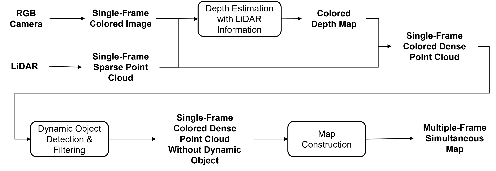

# DenseFusionMap
UMICH EECS568 Mobile Robotics Final Project - Dense Map Construction using RGB + LiDAR

## Pipeline



## Code Structure

```
DenseFusionMap/
├── README.md                         # Project overview and instructions
├── docs/                             # Design documents and technical reports
│   └── design.pdf
├── data/                             # Sensor data and calibration files
│   ├── calibration/                  # Camera and LiDAR calibration files
│   └── raw/                          # Raw RGB, LiDAR, and depth data
├── src/                              # Main source code
│   ├── config/                       # Configuration files and parameters
│   │   └── config.yaml
│   ├── depth_estimation/             # Modules for depth estimation from RGB
│   ├── slam/                         # SLAM module integrating RGB & LiDAR
│   ├── visualization/                # Visualization utilities
│   │   ├── plot_results.py
│   │   └── visualize_map.py
│   └── main.py                       # Entry point for running the full pipeline
├── tests/                            # Unit and integration tests
│   ├── test_localization.py
│   ├── test_mapping.py
│   └── test_depth_estimation.py
├── scripts/                          # Helper scripts (demo launch, data preprocessing, etc.)
│   ├── run_demo.sh
│   └── preprocess_data.sh
└── requirements.txt                  # Python dependency list
```

